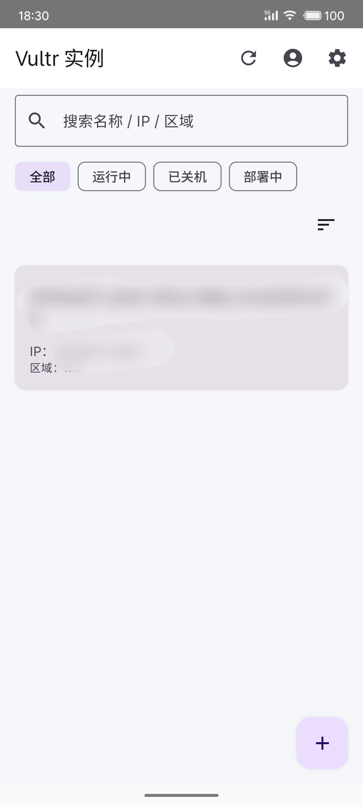
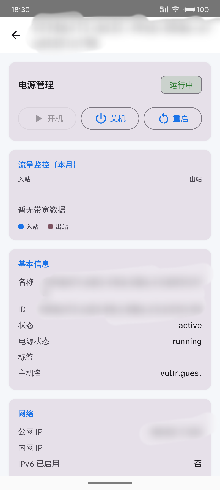
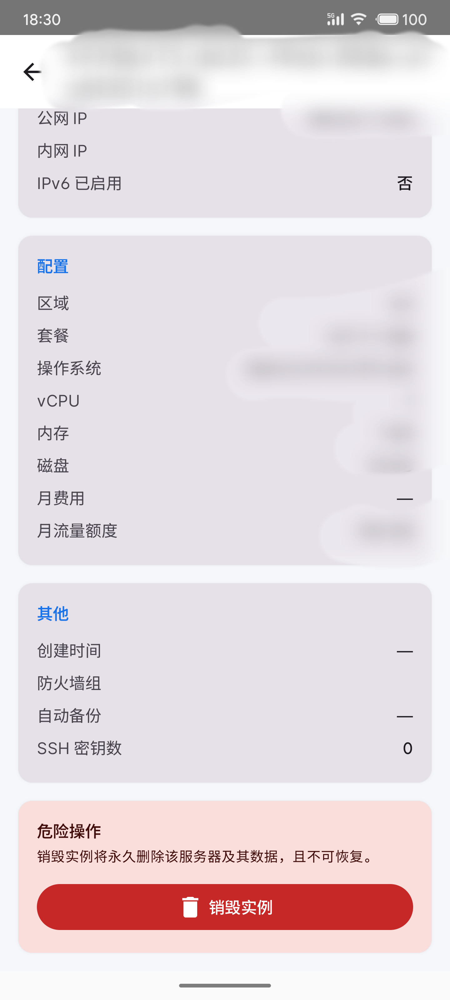
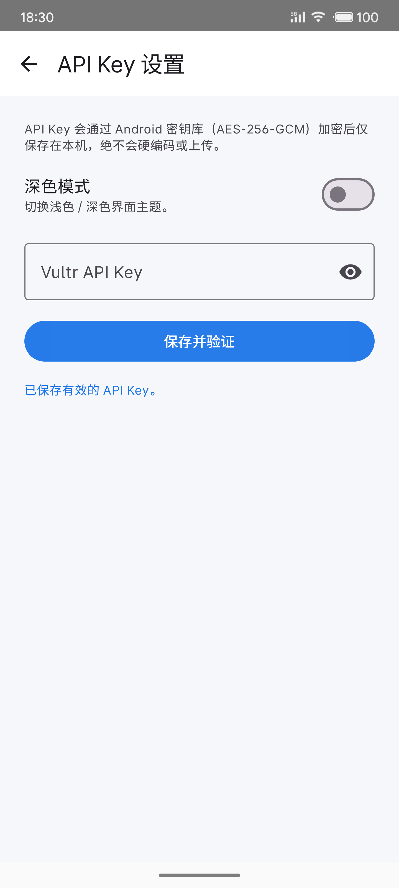

# Vultr Manager

一个使用 **Vultr API v2** 的第三方原生 Android 管理客户端，采用 Kotlin + Jetpack Compose 构建，可让你随时查看云服务器状态、创建/销毁实例、管理电源、查看账户账单与流量监控，并支持深色模式。

> 本应用为独立管理工具，与 Vultr 官方无隶属关系。API Key 仅通过 Android 密钥库加密保存在本地，不会硬编码或上传。

## 项目说明

- **本项目由 AI 全程生成**（基于对话式 AI 辅助编写全部代码与文档），主要用于**个人自用**，方便在手机上管理自己的 Vultr 服务器。
- 代码未经充分的测试与代码审查，可能存在 bug 或边界情况未覆盖，请自行评估风险后再使用。
- 欢迎参考、学习或自行改造，但**不保证功能完整性与安全性**，请勿用于生产环境或对外提供商业服务。

---

## 功能特性

### 实例管理
- **实例列表**：展示所有 Vultr 云服务器，显示名称、状态、IP、区域等关键信息。
- **搜索与筛选**：支持按名称 / IP / 区域搜索；可按运行中、已关机、部署中筛选状态。
- **排序**：支持按名称 A→Z / Z→A、状态、创建时间排序。
- **实例详情**：查看电源状态、公网/内网 IP、区域、套餐、操作系统、vCPU、内存、磁盘、月费用、月流量额度、创建时间、防火墙组、自动备份、SSH 密钥数等。
- **电源控制**：开机、关机、重启实例。
- **销毁实例**：危险操作二次确认后永久删除实例及数据。
- **创建实例**：通过表单选择区域、套餐、操作系统、启用 IPv6、SSH 密钥、自动备份、标签等，提交后自动刷新列表。

### 账户与监控
- **账户与账单**：查看账户余额、当月已计费和待计费金额。
- **流量监控**：展示实例本月入站/出站带宽使用情况（含图表）。

### 应用设置
- **API Key 配置**：首次启动需输入 Vultr API Key，保存时验证有效性。
- **安全存储**：使用 `EncryptedSharedPreferences`（Android 密钥库，AES-256-GCM）加密保存 API Key。
- **深色模式**：支持浅色/深色主题切换，即时生效。

---

## 技术栈

| 层级 | 技术 |
|------|------|
| 语言 | Kotlin |
| UI | Jetpack Compose + Material3 |
| 架构 | MVVM + ViewModelProvider.Factory |
| 导航 | Navigation Compose |
| 网络 | Retrofit2 + Gson + OkHttp |
| 协程 | Kotlinx Coroutines |
| 安全 | AndroidX Security Crypto（EncryptedSharedPreferences） |
| 最低版本 | Android 6.0（API 23） |
| 编译/目标版本 | API 34 |

---

## 运行截图

以下四张截图来自真机/模拟器，文件名即拍摄时间，展示应用的主要界面。

### 1. 实例列表



> 顶部标题栏含刷新、账户、设置入口；下方为搜索框与「全部 / 运行中 / 已关机 / 部署中」筛选标签，卡片展示每台服务器的名称、状态、IP、区域等关键信息（已模糊处理），右下角悬浮按钮（+）用于创建新实例。

### 2. 实例详情（上半部分）



> 顶部「电源管理」显示运行状态并提供开机、关机、重启按钮；随后是本月入站/出站带宽监控（无数据时显示图例），以及名称、ID、状态、标签、公网/内网 IP、IPv6 启用情况等基本信息与网络字段。

### 3. 实例详情（下半部分）与销毁



> 展示区域、套餐、操作系统、vCPU、内存、磁盘、月费用、月流量额度等配置信息，以及创建时间、防火墙组、自动备份、SSH 密钥数等附加项；底部红色卡片为销毁实例的危险操作区，需二次确认后永久删除。

### 4. API Key 设置



> 顶部说明 API Key 会通过 Android 密钥库（AES-256-GCM）加密后保存于本机；下方为深色模式开关、Vultr API Key 输入框（支持显示/隐藏）及「保存并验证」按钮，底部提示「已保存有效的 API Key。」表示验证通过。

---

## 快速开始

### 1. 获取 Vultr API Key
- 登录 [Vultr 控制台](https://my.vultr.com/)。
- 进入 **Account → API → Add API Key**，生成一个具有所需权限的 API Key。
- 建议仅开启读取账户、实例、账单等必要权限。

### 2. 构建与运行
1. 使用 Android Studio（推荐 Jellyfish 或更新版本）打开本项目。
2. 等待 Gradle Sync 完成，下载依赖。
3. 连接设备或启动模拟器（Android 6.0+）。
4. 点击 **Run**（▶）构建并安装应用。

### 3. 首次使用
- 安装后首次启动进入 **API Key 设置** 页。
- 输入你的 Vultr API Key，点击「保存并验证」。
- 验证通过后自动跳转到实例列表，即可开始管理服务器。

---

## 项目结构

```
VultrManager/
├── app/src/main/java/com/example/vultrmanager/
│   ├── data/
│   │   ├── remote/              # Retrofit API 接口与数据模型
│   │   ├── local/               # EncryptedSharedPreferences、ThemeStore
│   │   └── VultrRepository.kt   # 统一数据仓库
│   ├── ui/
│   │   ├── MainActivity.kt      # 应用入口与导航图
│   │   ├── instances/           # 实例列表、详情、创建
│   │   ├── account/             # 账户与账单
│   │   ├── settings/            # API Key 与主题设置
│   │   ├── components/          # 通用组件（状态标签、带宽图表等）
│   │   └── theme/               # Compose 主题
│   └── VultrManagerApp.kt       # Application 与依赖容器
├── app/src/main/res/drawable/ic_launcher.xml  # 应用图标
└── README.md
```

---

## 注意事项

- 本应用仅调用 **Vultr API v2** 标准接口，未使用任何非官方接口。
- 销毁实例为不可逆操作，请谨慎操作。
- 由于 Vultr API 流量监控数据可能存在延迟，新建实例可能需要一段时间后才会显示带宽图表。
- 深色模式状态使用普通 `SharedPreferences` 保存；API Key 使用 `EncryptedSharedPreferences` 加密保存。

---

## 许可

本项目基于 **MIT License** 开源，任何人可自由使用、复制、修改、分发或用于商业用途，只需在副本中保留原始版权声明与许可声明即可。详见 [LICENSE](LICENSE)。

> 软件按「原样」提供，不附带任何明示或暗示的担保；使用风险由使用者自行承担。
